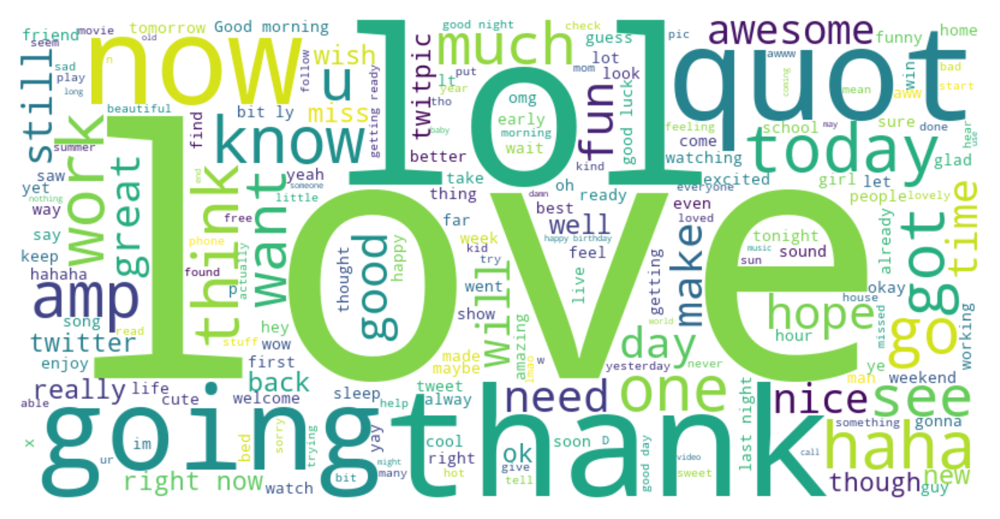
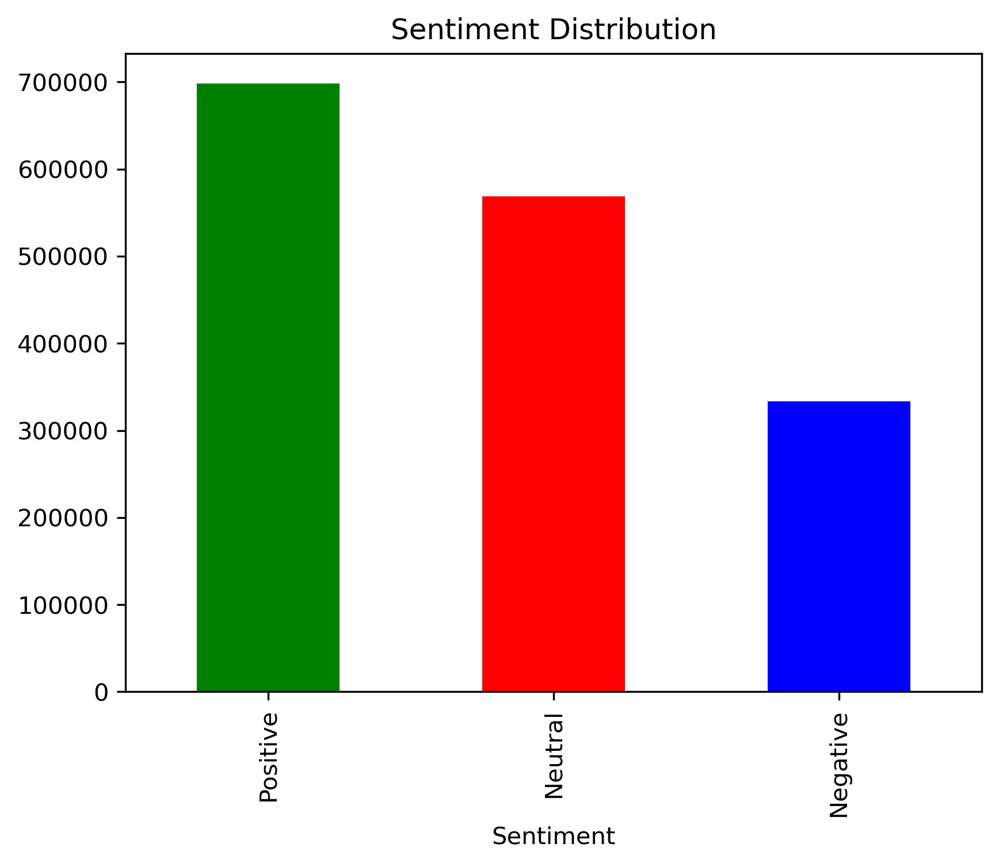

# 📝 Twitter Sentiment Analysis

This project was completed as part of my **AI Internship** at **Codec Technologies India**.
The objective was to analyze **tweets** and determine whether they express **Positive**, **Negative**, or **Neutral** sentiment using **Natural Language Processing (NLP)** techniques.

---

## 🚀 Features

* Processes and cleans raw tweet text
* Performs **sentiment classification** into Positive, Negative, or Neutral categories
* Generates **CSV reports** with sentiment scores and labels
* Includes basic data visualizations for sentiment distribution

---

## 🛠️ Tech Stack

* **Python 3**
* [pandas](https://pandas.pydata.org/) – Data handling and preprocessing
* [nltk](https://www.nltk.org/) – Tokenization, stopword removal, text cleaning
* [TextBlob](https://textblob.readthedocs.io/) – Sentiment scoring
* [matplotlib](https://matplotlib.org/) / [seaborn](https://seaborn.pydata.org/) – Data visualization

---

## 📂 Project Structure

```
├── Sentiment_Analysis.ipynb       # Main Jupyter Notebook
├── tweets.csv.zip                 # Raw tweets dataset (Google Drive)
├── sentiment_results.csv.zip      # Sentiment classification results (Google Drive)
├── README.md                      # Project documentation
```

---

## 📊 How It Works

1. **Load Dataset** – Reads tweets from the provided CSV file.
2. **Data Cleaning** – Removes punctuation, stopwords, special characters, and extra spaces.
3. **Sentiment Analysis** – Uses **TextBlob** to assign polarity scores.
4. **Classification** – Converts polarity into Positive, Negative, or Neutral labels.
5. **Visualization** – Plots sentiment distribution for better insights.
6. **Export Results** – Saves final sentiment results to a CSV file.

---

## ▶️ How to Run

1. **Clone the repository**

   ```
   git clone https://github.com/your-username/sentiment-analysis.git
   cd sentiment-analysis
   ```

2. **Install dependencies**

   ```
   pip install pandas nltk textblob matplotlib seaborn
   ```

3. **Download datasets**

   * [tweets.csv.zip – Google Drive Link](YOUR_TWEETS_CSV_LINK)
   * [sentiment\_results.csv.zip – Google Drive Link](YOUR_RESULTS_CSV_LINK)

   Unzip both files into the project directory.

4. **Run the Notebook**

   ```
   jupyter notebook Sentiment_Analysis.ipynb
   ```

5. **Outputs**

   * `sentiment_results.csv` with sentiment labels and scores
   * Sentiment distribution plots

---

## 📌 Example Visualization




---

## 📅 Future Improvements

* Integrate **Twitter API** for real-time sentiment analysis
* Add **multilingual sentiment support**
* Use advanced NLP models (e.g., BERT, RoBERTa) for better accuracy

---

## 📜 Internship Context

This project was completed as a **Task** under the **AI Internship** by **Codec Technologies India**.
It is one of the deliverables for the internship submission.
